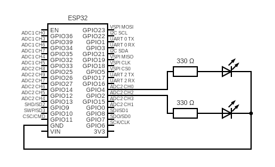

# Telemetry
This project is an ESP-WROOM-32 based telemetry system that collects and processes sensor data. It includes code for managing sensors and visual indicators (LEDs) connected to the ESP32, designed with modular components and using ESP-IDF.

## Features
- Real-time telemetry data acquisition
- LED indicators controlled via ESP32 GPIO pins
- Modular components for easy expansion
- Built with ESP-IDF and CMake

## Electrical Schematic
The LEDs are connected to the ESP-WROOM-32 through resistors, as shown in the schematic below. This ensures correct current limiting and stable operation.




## Getting Started
### Prerequisites
- ESP-IDF development environment installed
- Python 3.x
- Git (for cloning the repo)

### Setup
1. Clone this repository:
   ```bash
   git clone https://github.com/Zac-Unmade/Telemetry.git
   cd Telemetry ```
2. Set up the ESP-IDF environment:
   ```bash
   . $HOME/esp/esp-idf/export.sh ```
3. Configure the project:
   ```bash
   idf.py menuconfig ```
4. Build the project:
   ```bash
   idf.py bulid ```
5. Flash the firmware to your ESP32:
   ```bash
   idf.py flash ```
6. Monitor the serial output:
   ```bash
   idf.py monitor ```

## Folder Structure
- main/ — Main application source code and CMakeLists
- components/cjson/ — External JSON parsing library component
- build/ — Build output (excluded from repo)
- .vscode/ — Editor settings (excluded from repo)

